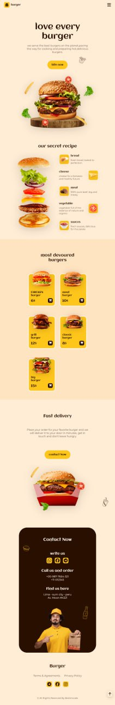

# Restaurant Landing Page

## Overview

This project is a responsive restaurant landing page that I built as part of a tutorial. It helped me significantly in understanding proper web design practices, layout techniques, and clean coding standards.

## Purpose

The primary goal of this project was to follow a structured tutorial to learn and implement various front-end development techniques. Although the project is based on a tutorial, I took extra steps to understand every detail and improve my development skills.

## Key Learning Points

- **Proper Layout Techniques:** Learned how to structure a webpage with proper layouts, ensuring content is well-organized and visually appealing.
- **Class Naming Conventions:** Gained knowledge on using clear, descriptive class names and additional classes for reuse across different elements, enhancing maintainability and scalability.
- **CSS Variables:** Understood the use of CSS variables for consistent styling and easier theme management across the webpage.
- **Effective Use of Comments:** Learned to document code effectively using comments to explain sections, making the codebase easier to understand and maintain.
- **Responsive Design:** Applied responsive design principles to ensure the page looks great on various devices and screen sizes.

## Features

- **Responsive Design:** The site is fully responsive, adjusting seamlessly across desktop, tablet, and mobile devices.
- **Semantic HTML:** Utilizes semantic elements to improve accessibility and SEO.
- **CSS Animations:** Includes subtle CSS animations to enhance user interaction without overwhelming the user experience.
- **Clean Code Practices:** Emphasis on clean, readable code with proper comments and organization.

## Credits

This project was created following a tutorial from [Bedimcode](https://www.youtube.com/@Bedimcode). You can view the original tutorial video here: [How to Make a Responsive Restaurant Website Design](https://youtu.be/PA-V-GxYa9w?si=cp5vea_tKG4I4FKK).

## Contributing

This project is a personal learning exercise, but I'm open to feedback and suggestions. Feel free to open an issue or submit a pull request if you have any ideas for improvement.

## Demo 

-[burger totorial](https://first-try1.netlify.app/)

## Screenshot

